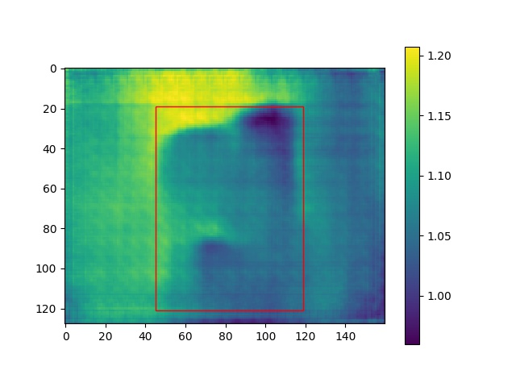

# Single Object Detection with Depth Prediction

## Overview
A beginner of deep learning in junior year second semester. For this project, I think from automatic moving machine.
Automatic moving machines are like autopilot, drones, or robots that are able to move automatically in house environment. The most important thing about these machines is to identify the location of the target object, and then to be able to know the distance, and move to the target object position. So I combined the object detection and depth prediction based on YOLO and FCRN to do this project.

## Demo
1. Parameter for YOLO: https://github.com/Ching-Ju-Henry/YOLO_tensorflow (or train by yourself)
2. Parameter for FCRN: https://github.com/iro-cp/FCRN-DepthPrediction (or train by yourself)
3. Resize the imput image: using *resize.py* to resize the input image
4. Object Detection Algorithm: using *YOLO_small_tf.py* to detect the object in input image
5. Depth Prediction Algorithm: using *predict.py* to predict depth for input, and then combine it with object detection
6. Results: In the deep file

## Result
**1. Flow Chart**

 

**2. Some Results**
<table border=1>
<tr>
<td>

</td>
</tr>

</table>

## Requirements
* TensorFlow
* numpy, matplotlib, opencv, pillow

## Reference
